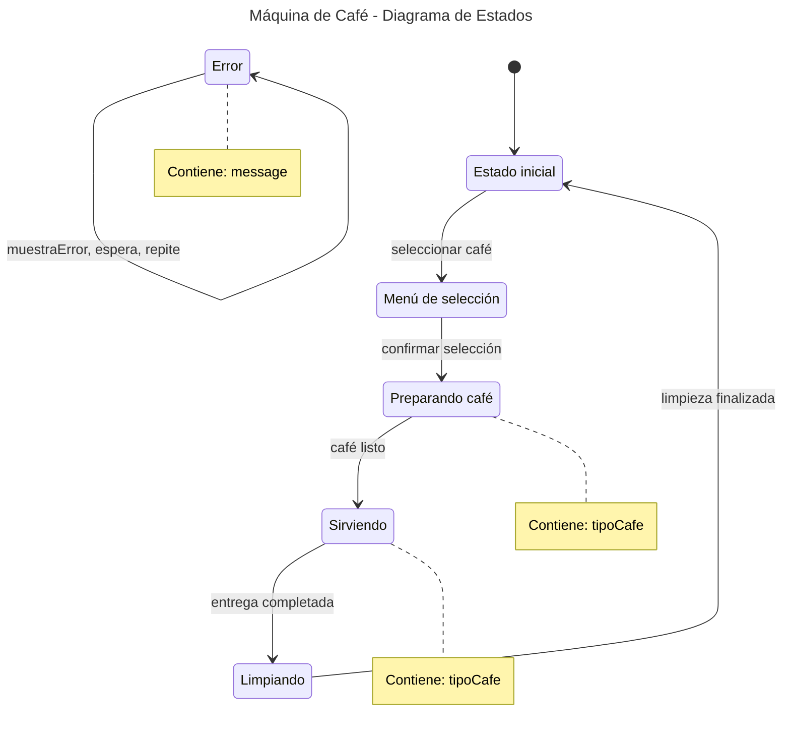

### Máquina de Café de Estados 

Este proyecto es un ejemplo práctico que implementa el patrón Máquina de Estados Finitos (FSM) para simular el ciclo de vida de una máquina de café. Está diseñado para demostrar cómo aprovechar las potentes características del lenguaje Kotlin, como las clases selladas (sealed class) y los objetos singleton (object), para construir un código seguro, expresivo y fácil de mantener.

 ### Características Clave

    Modelado de Estados con sealed class
    Todos los estados posibles de la máquina se definen en la clase sellada EstadoMaquinaCafe. Esto garantiza que el compilador verifique exhaustivamente todas las transiciones posibles, evitando errores en tiempo de ejecución. 

    Encapsulación mediante Singleton
    La lógica central y el estado actual de la máquina están encapsulados en el object MaquinaDeCafe, que actúa como un singleton, asegurando un único punto de control del flujo de la máquina. 

    Transiciones Seguras con when
    Las transiciones entre estados se manejan mediante expresiones when combinadas con comprobaciones de tipo (is). Esto elimina la necesidad de casts manuales y mejora la seguridad del código (¡adiós, ClassCastException de Java!). 

    Interfaz de Usuario Modular
    Se incluye una clase base InterfazUsuario que puede extenderse fácilmente para soportar distintos tipos de salidas: consola, interfaz gráfica (GUI), logs, etc. 

 ### Diagrama de Estados (FSM)

El comportamiento de la máquina se rige por una serie de estados y transiciones bien definidas. El flujo se controla cambiando la variable estadoActual, respetando siempre las reglas del siguiente diagrama:

